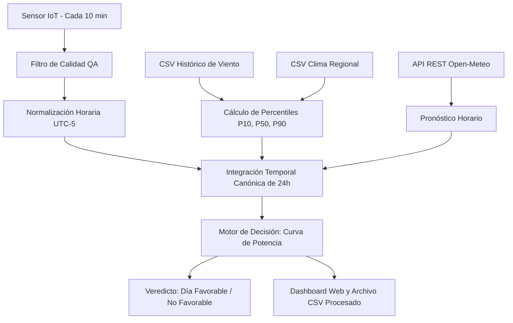

# Taller de Adquisición e Integración de Datos
## Propuesta Técnica: Sistema de Evaluación Energética para el Parque Eólico Windpeshi

**Asignatura:** Adquisición e Integración de Datos  
**Facultad de Ingeniería**  
**Integrantes:** [Nombre de los Estudiantes]  
**Docente:** [Nombre del Docente]  
**Fecha:** Septiembre de 2026  

---

### Resumen del Proyecto
Este trabajo presenta el diseño e implementación de un sistema para determinar si las condiciones meteorológicas de un día determinado son favorables o no para la generación de energía eólica en el Parque Windpeshi (La Guajira). El sistema cumple con los requerimientos del taller integrando cuatro fuentes de datos independientes (una primaria basada en un sensor in-situ, dos archivos planos históricos y una API externa de pronóstico meteorológico), aplicando un pipeline completo de adquisición, control de calidad, normalización horaria, integración y reglas de decisión basadas en la curva de potencia de los aerogeneradores.

---

## 1. Definición del Problema y Justificación

El Parque Eólico Windpeshi, ubicado entre los municipios de Uribia y Maicao en La Guajira, aprovecha los vientos Alisios característicos de la región. Sin embargo, la velocidad del viento es variable a lo largo del día y del año. Para planificar la entrega de energía al sistema eléctrico, el operador necesita saber con antelación si las condiciones de una jornada permitirán una operación rentable y segura.

El problema que resolvemos consiste en comparar lo que mide la instrumentación del parque en tiempo real y lo que proyectan los pronósticos meteorológicos contra los registros históricos de la zona, emitiendo un diagnóstico diario clasificado como:
- **Día Favorable:** Si la velocidad del viento se mantiene la mayor parte del tiempo dentro del rango óptimo de generación de las turbinas (entre 3.5 m/s y 25 m/s) y la energía esperada es competitiva frente a la mediana histórica.
- **Día No Favorable:** Si predomina viento insuficiente (por debajo de la velocidad de arranque o cut-in) o ráfagas peligrosas de tormenta que obliguen a detener las máquinas por seguridad.

---

## 2. Fuentes de Datos Seleccionadas

Siguiendo las restricciones de la guía (mínimo 3 fuentes, máximo 2 archivos planos y al menos una fuente primaria tipo sensor), definimos las siguientes cuatro fuentes:

| Fuente | Tipo de Origen | Mecanismo y Formato | Variables Medidas | Justificación Técnica |
| :--- | :--- | :--- | :--- | :--- |
| **Fuente 1 (Primaria)** | Sensor físico in-situ | Simulación de telemetría IoT cada 10 minutos (144 muestras/día) | Velocidad del viento (m/s), dirección (°), presión (hPa) | Representa la estación anemométrica de la torre meteorológica del parque. Es la fuente primaria de validación en tiempo real. |
| **Fuente 2 (Secundaria)** | Archivo plano | Archivo CSV (`windpeshi_historical.csv`), 8.760 registros horarios | Velocidad del viento, dirección, potencia generada (kW), estado operativo | Contiene un año completo de datos del parque para calcular percentiles de referencia (P10, P50, P90). |
| **Fuente 3 (Secundaria)** | Archivo plano | Archivo CSV (`regional_weather.csv`), 8.760 registros horarios | Temperatura ambiente (°C), humedad relativa (%), presión atmosférica (hPa) | Datos meteorológicos regionales que permiten entender el comportamiento termodinámico del aire. |
| **Fuente 4 (Externa)** | Servicio web externo | Petición HTTP GET a la API REST de Open-Meteo (formato JSON) | Pronóstico horario a corto plazo de viento a 10m, ráfagas y temperatura | Permite incorporar pronósticos globales satelitales para contrastar con las mediciones locales del sensor. |

---

## 3. Etapas del Ciclo de Datos

En el desarrollo del taller abordamos los cuatro conceptos principales de la materia:

### 3.1 Adquisición de Datos (DAQ)
Se diseñaron módulos independientes en Python para cada origen:
- La telemetría del sensor se simula respetando la variación del viento con ruido estocástico e inyección ocasional de lecturas anómalas para probar el sistema.
- Los archivos CSV se leen validando que las columnas requeridas existan antes de procesar.
- La API de Open-Meteo se consume mediante solicitudes REST con control de tiempo de espera (timeout) y manejo de errores HTTP.

### 3.2 Digitalización
En la fuente primaria se modela el paso de la señal continua del viento a paquetes digitales discretos emitidos a intervalos regulares de 10 minutos, generando una serie de tiempo estructurada.

### 3.3 Codificación y Control de Calidad
- **Unidades:** Todas las magnitudes se homogeneizan al Sistema Internacional (velocidad en m/s, presión en hPa, temperatura en °C).
- **Husos Horarios:** Se fuerza la zona horaria `America/Bogota` (UTC-5) para corregir el desfase entre los datos satelitales (que vienen en UTC) y la hora local de La Guajira.
- **Filtro de Calidad (QA):** Creamos una función que detecta y descarta automáticamente datos imposibles causados por fallas del sensor:
  - Valores negativos de viento ($v < 0$).
  - Puntas de lectura irreales ($v > 45\text{ m/s}$).
  - Presiones fuera de rango atmosférico costero ($< 850\text{ hPa}$ o $> 1100\text{ hPa}$).
  - Registros nulos o incompletos.

### 3.4 Transformación e Integración
Dado que el sensor reporta cada 10 minutos (144 registros diarios) y los archivos históricos junto con la API trabajan a escala horaria (24 registros diarios), se realiza un remuestreo temporal (`resample('1h')`). Se calcula la velocidad promedio y la ráfaga máxima de cada hora.
Posteriormente, se hace un cruce temporal (merge) de las 24 horas del día evaluado junto con los percentiles históricos correspondientes a cada hora.

---

## 4. Diagrama del Flujo de Datos (Pipeline)

---

## 5. Reglas del Motor de Decisión (Física Eólica)

Para clasificar una jornada nos basamos en los parámetros operativos reales de un aerogenerador comercial de 3.0 MW:

- **Velocidad de arranque (Cut-in = 3.5 m/s):** Por debajo de este valor, la fuerza del viento no vence la inercia del rotor. Potencia = 0 kW.
- **Velocidad nominal (Rated = 12.0 m/s):** Velocidad a partir de la cual la turbina entrega su potencia máxima (3000 kW), controlada por el ángulo de las palas.
- **Velocidad de corte por seguridad (Cut-out = 25.0 m/s):** Ante vientos iguales o superiores, el sistema frena la máquina para evitar daños mecánicos estructurales.

### Criterio de Decisión:
Un día se clasifica como **Día Favorable** si:
1. Al menos el 66% del tiempo (16 de las 24 horas) el viento efectivo se mantiene dentro del rango operativo $[3.5,\ 25.0]\text{ m/s}$.
2. No se presentan más de 2 horas con velocidades por encima de la velocidad de corte ($> 25\text{ m/s}$).
3. La velocidad promedio diaria se compara contra la mediana histórica P50 para contextualizar el rendimiento energético esperado.

---

## 6. Análisis de Problemáticas Potenciales y Mitigación

Como parte del análisis técnico, identificamos cuatro falencias comunes en este tipo de proyectos en La Guajira y sus soluciones:

1. **Fallas de Conectividad en Zonas Remotas:** La Alta Guajira presenta intermitencias en la red celular.  
   *Solución:* Implementación de almacenamiento local tipo buffer (FIFO) en la estación física para retener los datos hasta por 7 días y retransmitir cuando vuelva la señal.
2. **Desgaste de Sensores por Salitre y Arena:** El ambiente marino desértico deteriora los rodamientos de los anemómetros mecánicos de cazoletas.  
   *Solución:* Uso de anemómetros ultrasónicos (sin partes móviles) con protección sellada IP67.
3. **Discrepancia entre Modelos Globales y Terreno Local:** Las APIs de pronóstico satelital cubren áreas amplias y pueden subestimar el efecto térmico entre el mar y las dunas.  
   *Solución:* Calibración estadística de los datos de la API utilizando el histórico real del parque (corrección de sesgo).
4. **Congestión en la Red Eléctrica (Curtailment):** Retrasos en las líneas de transmisión nacional pueden obligar a frenar turbinas aunque haya viento.  
   *Solución:* Considerar bancos de baterías (BESS) para almacenar excedentes y aprovechamiento para electrólisis de hidrógeno verde.

---

## 7. Implementación y Validación

El pipeline se programó de forma modular en Python:
- `config/settings.py`: Parámetros geográficos y técnicos centralizados.
- `scripts/generate_historical_data.py`: Generador de los datasets sintéticos basado en la distribución estadística de Weibull ($k=2.2, c=9.8\text{ m/s}$) propia de los vientos de La Guajira.
- `src/daq/`: Módulos de adquisición para CSV, API y sensor.
- `src/processing/`: Filtro de calidad, normalizador UTC-5 e integrador.
- `src/domain/`: Lógica física de la turbina y evaluador de favorabilidad.
- `web_server.py`: Servidor local para interactuar con la herramienta mediante interfaz gráfica en el navegador y descarga directa de reportes.
- **Exportación de Datos (Salida Dual):**
  - **Archivo CSV (`data/processed/integrated_*.csv`):** Formato plano interoperable listo para ingesta en bases de datos o pipelines de datos.
  - **Libro Microsoft Excel (`data/processed/integrated_*.xlsx`):** Diseñado con dos hojas de trabajo: `Datos_Horarios_24h` (tabla analítica completa) y `Resumen_Ejecutivo` (KPIs, veredicto y reporte de calidad de datos).

Se realizaron pruebas unitarias automatizadas (`tests/test_pipeline.py`) verificando el descarte de anomalías, la exportación a Excel/CSV y el cálculo de la curva de potencia, obteniendo resultados correctos en todas las pruebas.
